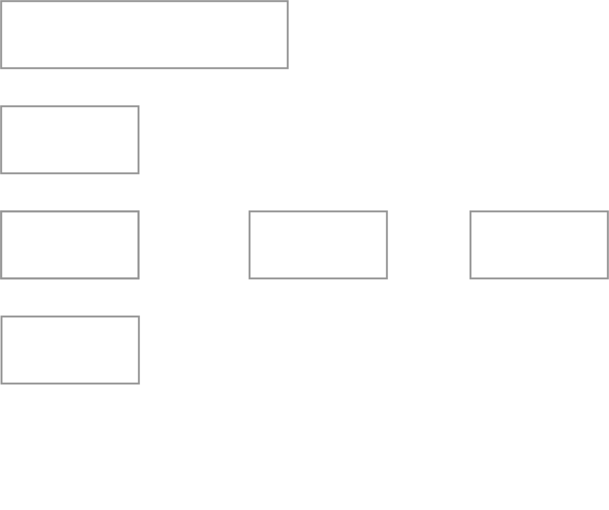

## Google Lighthouse 
<!-- .element width="400" style="border: 0; background: None; box-shadow: None;" -->

### Bedingungen
- Anspruch auf grünes Licht <!-- .element: class="fragment" -->
- Performance ist ein Näherungswert  <!-- .element: class="fragment" -->
- "Typically a score above 90 represents the top 5 percent of top-performing pages."<!-- .element: class="fragment" -->
- Time To Interactive < 5 Sekunden <!-- .element: class="fragment" -->

## (Live Audit)

<!-- .element width="700" style="border: 0; background: None; box-shadow: None;" -->
