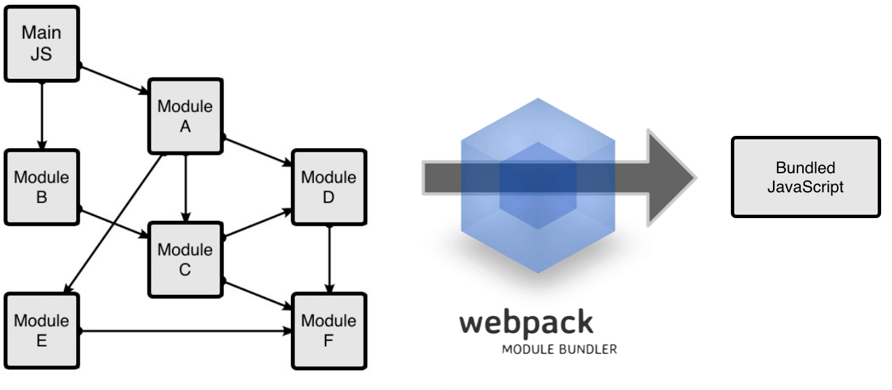

## Performance Optimization
- Lazy Loading von Bildern <!-- .element: class="fragment" -->
- JS minify <!-- .element: class="fragment" -->
- JS Bundling <!-- .element: class="fragment" -->


## Webpack Bundling
<!-- .element width="400" -->


## Code splitting/chunking


## (FoamTree JS Analysis Tool)


## Webpack dynamic imports
```javascript
// Static Import
import MyComponent from './MyComponent.vue'
export default {
        name: 'MyParentComponent',
        components: { MyCoolComponent },
}

// Dynamic Import
export default {
  components: {
    lazyComponent: () => import('MyComponent.vue')
  }
}
```


### Lazy Loading von Komponenten 
- Routen = Vue.js Komponenten = Routenbasiertes Codesplitting <!-- .element: class="fragment" -->
- Laden von Komponenten anhand von Events (scroll, click, etc...)  <!-- .element: class="fragment" -->

 <!-- .element: class="fragment" -->


### (Beispiel in Devtools Lazy Loading Footer Chunks)
